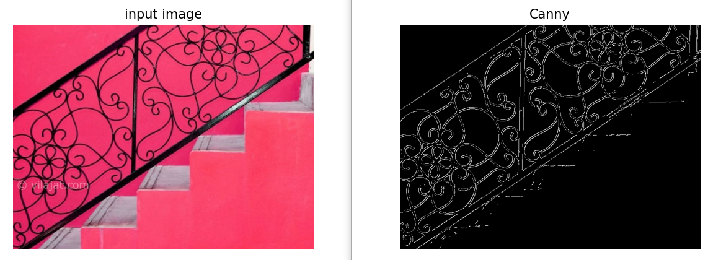

# Canny-Edge-Detector-Implementation

The Canny edge detector is an edge detection operator that uses a multi-stage algorithm to detect a wide range of edges in image. it is consist of steps.

1. Smoothing
2. Finding gradient magnitude and angel
3. None maximum suprision
4. Applying two threshold to devide edges in 3 classes (strong edges, weak edgs, non-edges)

# 1. Smoothing
Using Gussian filter to reduce noises.

# 2. Finding gradient magnitude and angel
Using the Sobel filter to find the vertical and horizontal gradients. Then finding the magnitude and angle of the gradient of pixels.

# 3. None maximum suprision
This method removes extra edges by finding the pixel with the greatest magnitude alongside the gradient direction.

# 4. Applying two threshold
Applying min_threshold and max_threshold. This divides edges into 3 classes. Pixels with values greater than max_threshold are considered edges, and those with values lower than min_threshold are considered non-edge. Pixels with a value between these two thresholds are considered weak edges. weak edges, which are connected to strong edges will remain and others will be removed 

# Result
